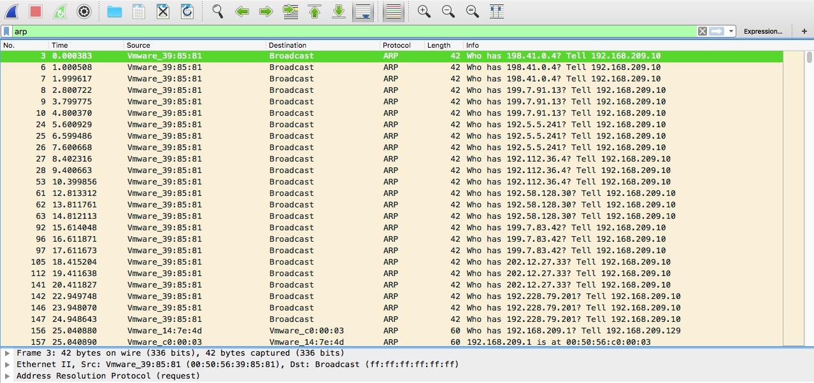
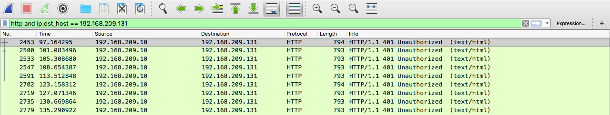
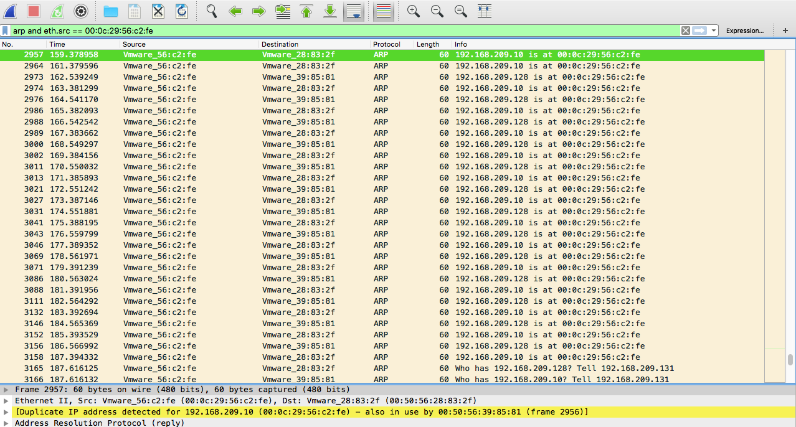
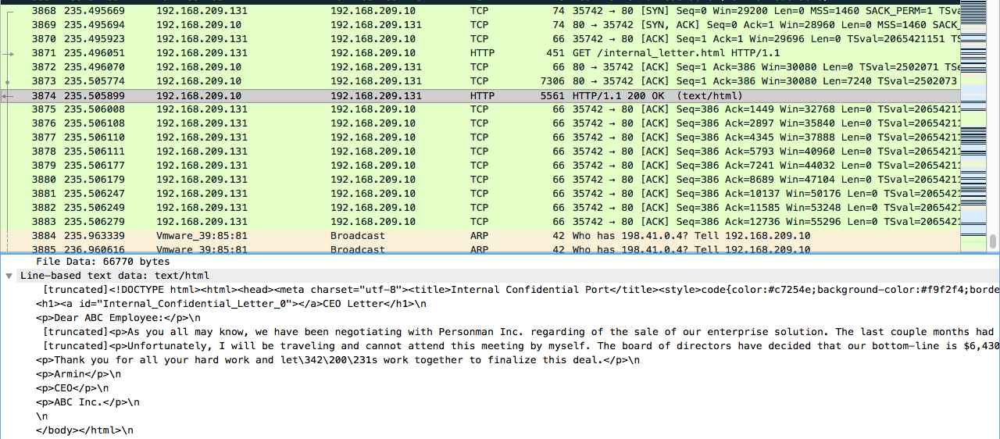

# Practical Cybersecurity Assignment: Network Forensics

## Background
ABC Inc., a small tech startup company, is negotiating a business with another company,
Personman Inc. Before meeting with Personman representatives, ABC board of directors
decided that the lowest price acceptable for ABC is $6,430,000. During the meeting, however,
Personman representatives surprisingly gave the exact same price, $6,430,000, in their offer.
Therefore, following the confidential strategy given by the CEO, ABC representatives had to
accept this offer.


The CEO of ABC Inc. is very surprised by the result. Doubting it is a coincidence, the CEO
suspects that either some member of the negotiation team leaked the confidential strategy to
Personman, or Personman representatives somehow obtained the information illegally. ABC,
Inc is investigating this incident and gathering evidence. Fortunately, the company keeps
monitoring network traffic on the internal webserver, which was used to share the confidential
strategy between the CEO and negotiation team. The web folder that contains the negotiation
plan is password-protected. The network topology is shown below. During the business
negotiation, Personman Inc. employees have visited ABC Inc.’s premise multiple times.


## Task
You are hired as a forensic consultant for the investigation. You are given a pcap file that
contains the network traffic seen at the web server. Please use your knowledge in network
analysis to help find out how the confidential information was leaked. Please submit a one-page
document that describes your investigation results. List your investigative steps and the
evidence that helps you reach your conclusion.


## Analysis
The first suspicious behavior I noticed was an `nmap` scan with ARP.
`nmap` is commonly used to scan an ethernet LAN. When `nmap` tries to send a raw IP packet such 
as an ICMP echo request, the operating system must determine the destination hardware address 
corresponding to the target IP so that it can properly address the ethernet frame. This is often 
slow and problematic, since operating systems weren't written with the expectation that they 
would need to do millions of ARP requests against unavailable hosts in a short time period 
(it is common that in private networks, the majority of the addresses are unused at a given time).

ARP scan puts `nmap` and its optimized algorithms in charge of ARP requests. And if it gets a 
response back, `nmap` doesn't even need to worry about the IP-based ping packets since it already 
knows the host is up. This makes ARP scan much faster and more reliable than IP-based scans. 
So it is done by default when scanning ethernet hosts that `nmap` detects are on a local 
ethernet network. 



This is where I got the attacker's MAC address, **00:0c:29:56:c2:fe**. From this scan, we can see 
that the addresses **192.168.209.{10, 128, 129, 254, 128}** are being used.

Afterwards, a reverse DNS lookup was performed on these IPs; no information was obtained. Also, 
a port scanning was ran on the five hosts. Of these, **192.168.209.254** had all ports closed. 

Knowing that port 80 was open on **192.168.209.10**, the attacker used a browser to interact 
with the web server and tried to used common credentials to authenticate.



In order to obtain somebody else's credentials to authenticate with the server, the attacker 
performed the Man In The Middle (MITM) technique.

Using `arpspoof`, he or she blasted out ARP packets telling **00:50:56:28:83:2f** and 
**00:50:56:39:85:81** that **192.168.209.10** and **192.168.209.128** were at **00:0c:29:56:c2:fe**



As a MITM, the attacker intercepted several packets, and although we do not have the evidence 
to prove that he or she intercepted the specific packet with the authentication credentials 
to the web server, we know that it happened because there is evidence to the fact that he 
or she was able to authenticate with the correct credentials.


```
3871	235.496051	192.168.209.131	192.168.209.10	HTTP	451	GET /internal_letter.html HTTP/1.1 
3874	235.505899	192.168.209.10	192.168.209.131	HTTP	5561	HTTP/1.1 200 OK  (text/html)
```



Where he or she found the confidential information.

```html
CEO Letter
Dear ABC Employee:

As you all may know, we have been negotiating with Personman Inc. regarding of the sale of our enterprise solution. The last couple months had been a tough time for all of us. But I...m happy to let you know that Personman finally decided to purchase our solution. The next Wednesday, Feb 2, 2017, we will host a meeting with Personman representatives in the Mayflower hotel, Washington D.C. to finalize the sale price.

Unfortunately, I will be traveling and cannot attend this meeting by myself. The board of directors have decided that our bottom-line is $6,430,000. However, we would like to make a higher profit out of this deal. Please keep this information confidential.

Thank you for all your hard work and let...s work together to finalize this deal.

Armin

CEO

ABC Inc.
```

